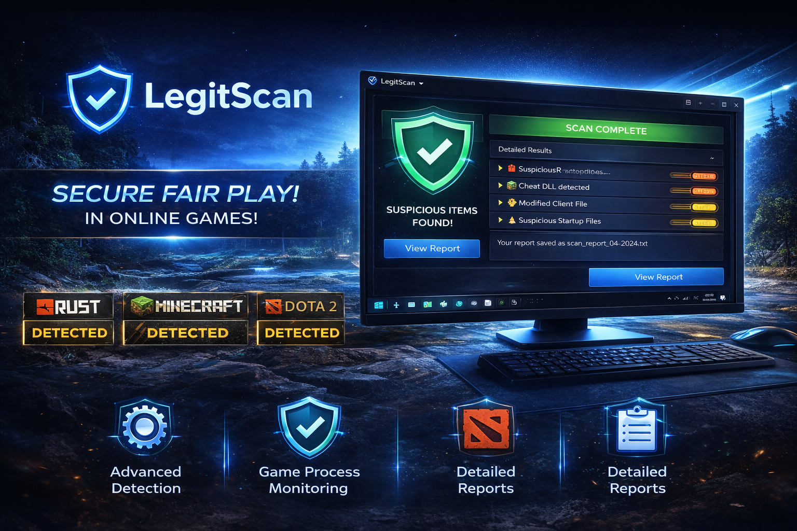

  

<h1 align="center">LegitScan</h1>

  Part of the <b>Anti-Cheat Verification Pack</b> series

  
  
  
  

---

## 🔍 About

LegitScan is an advanced anti-cheat verification tool designed to detect unauthorized software, suspicious processes, and modified game files.

Built for fair-play control, tournament verification, and system inspection.

---

## ⚙️ Features

- Advanced process inspection
- Heuristic-based detection engine
- Suspicious file analysis
- Startup registry inspection
- Optimized report generation
- Reduced false positives
- Improved scan performance

---

## 🎮 Supported Games

- Rust
- Minecraft
- Counter-Strike 2
- Dota 2
- Custom Clients

Detection methods are continuously updated to support new builds and client modifications.

---

# 🔥 RageScan

Part of the Anti-Cheat Verification Pack series.

---

## 🚧 Status

Coming Soon — Advanced memory-level inspection module.

---

## 🎯 Planned Features

- Memory-level inspection engine
- Deep process analysis
- Advanced heuristic detection
- Real-time monitoring
- Extended compatibility layer

---

## 📅 Release Status

Under development.

## 📦 Download

Go to **Releases** and download the latest version.

---

## 🔐 Archive Protection

Password: `legitscan`  
(Archive is protected to prevent false antivirus false positives.)

---

## 📈 Changelog

### v2.7.43
- Improved heuristic detection engine
- Faster scan completion
- Reduced false positives
- Enhanced startup registry inspection

### v1.0
- Initial release

---

## 🚀 Roadmap

- [ ] Real-time monitoring module
- [ ] Extended memory analysis
- [ ] Cloud-based signature updates
- [ ] RageScan integration

---

## 🏢 About the Series

Anti-Cheat Verification Pack is a toolkit lineup focused on system inspection and fair-play analysis.

Upcoming tools:
- LegitScan
- RageScan
- FutureScan

---

## 📄 License

MIT License
